# Product Listing-Page

- [Summary](#summary)
- [Header](#header)
- [Sidebar](#sidebar)
- [Middle Part](#middle-part)
- [Footer](#footer)
- [Installation Steps](#installation)

### Summary

This is an e-commerce website developed using ReactJS, designed to provide a smooth and intuitive shopping experience. The application features five product categories - shoes, clothes, watches, bags and phones. Each category houses multiple products complete with images, short product description, price, add to bag button and star rating. It has simple functionalities such as - search bar, filtering by price and color and sorting. The application is fully responsive and is looking good in both PC and mobile.

The project has been built using a number of development tools to ensure high-quality code and a streamlined development process:

- Vite: Used as the build tool and development server.
- Prettier: An opinionated code formatter used in this project to ensure code consistency and readability.
- ESLint: A pluggable and configurable linter tool for identifying and reporting on patterns in JavaScript.
- React Librairies - react-dom, react-router-dom, react-icons and react-toastify.

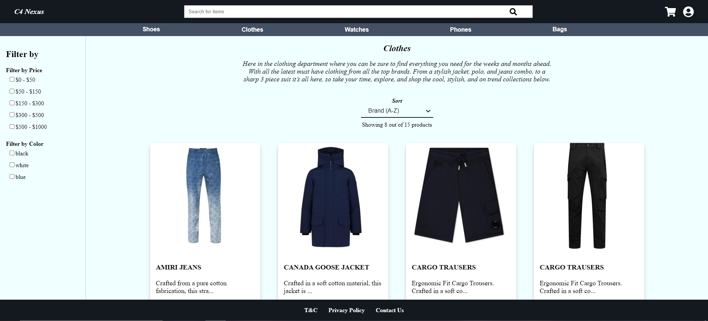
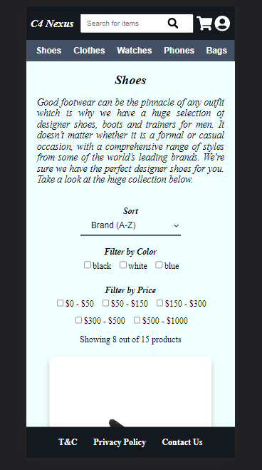
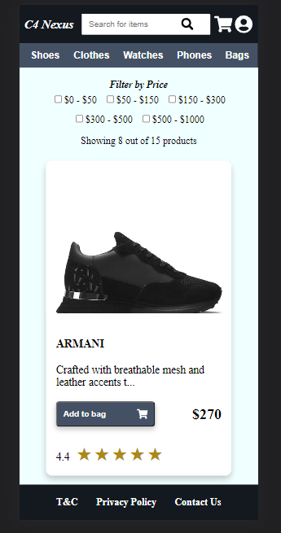

The application consists of 4 main sections - header, sidebar, middle part and footer

### Header

Positioned at the top of the application it includes a header section and subheader/navigation. It is sticky and is always on display.

- Header - splitted into 3 parts - logo, search bar and icons.
  Search Bar: Located in the middle of the header, the search bar provides functionality which allows the users to find the products they're looking for. As users type something, the application checks for matches within the json product file. It then displays these matching products, complete with their images, names, and an 'Add to Cart' button, enabling users to add the product to the cart. When the button is cilcked a notification pops up at the right top corner. This interactive feature enhances the user experience by providing quick, efficient access to the desired products.

- Subheader/Navigation - It includes 5 buttons to navigate through the application.

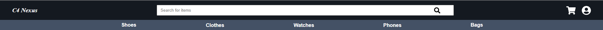
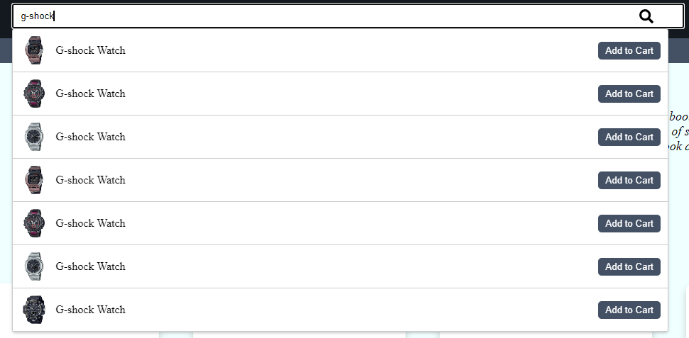

### Sidebar

The Sidebar in the application allows the user to filter products by price and color.

With color filtering, users can choose a specific color to view products in that particular shade. This is incredibly useful for users who have a clear color preference for the item they're seeking.

The price filter, on the other hand, allows users to define a price range that suits their budget. The application then presents products that fall within this selected price range, assisting users in making financially sound choices.

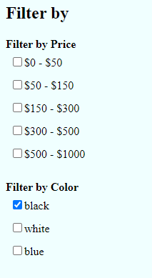
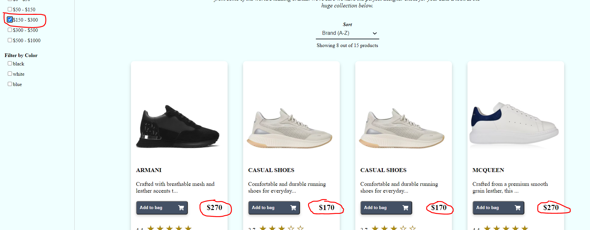
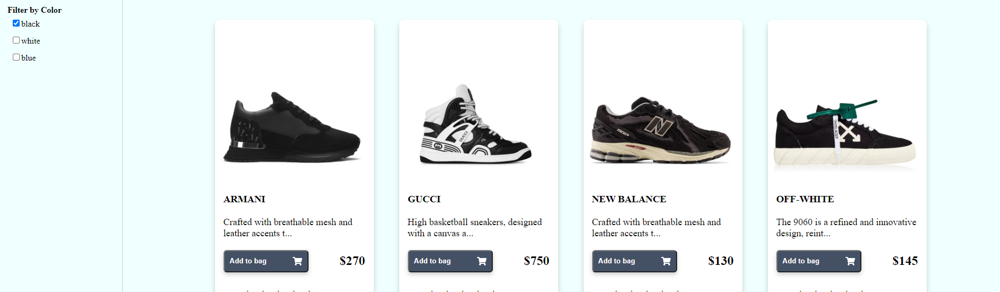

### Middle Part

The Middle Part of our application forms the core of the user's browsing experience. Here, users are presented with a variety of features designed to enhance their interaction with the product list.

- Title Category: This displays the name of the product category the user is currently viewing.

- Description: This is a brief text that provides more context about the chosen category. It helps users understand what kinds of products they can expect in this section.
  
  

- Sorting Mechanism: To improve usability, a sorting mechanism is included. This allows users to arrange the displayed products based on product name - A-Z / Z-A and price low-to-high and high-to-low.
  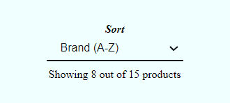

- Product Counter: This is a small informative feature that shows the number of displayed products out of the total number in the category for example 'Showing 8 of 16 products'.
  

- Product Cards: These are the visual representation of each product. They usually contain an image of the product, its name, price, a brief description and rating. They provide a snapshot of what the product offers.
  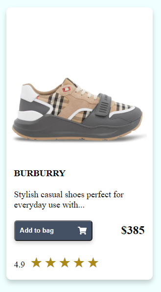

- Load More Button: When clicked, it loads more product cards, if available, giving the users the option to explore more products within the category.
  It is important to mention that each page when is loaded displays 8 items. In order to see more the 'Load more' button should be pressed to load another row of 4 products until all products are displayed.
  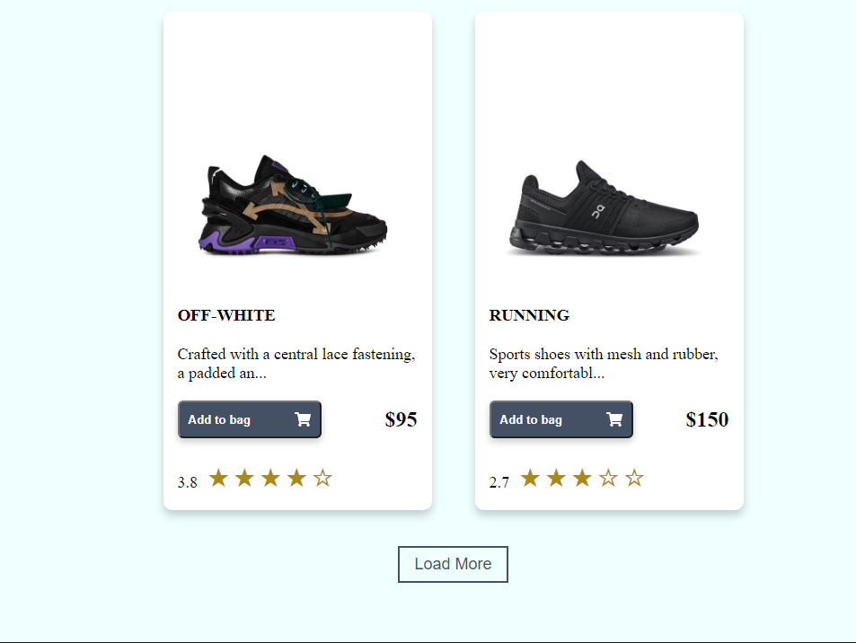

- Notifications: When user clicks 'Add to cart' button a notification pops up in the right top corner notifying us that the product is succesfully added to the shopping cart.
  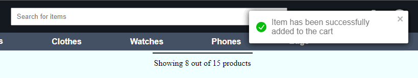

All these features in the Middle Part work together to provide a comprehensive, flexible, and engaging browsing experience, keeping users informed and in control as they explore the various products on offer.

### Footer

Found at the bottom of our application, the Footer offers additional information and links to T&C, Privacy Policy and Contact page. It is sticky and is always on display.

### Installation Steps

Clone the Repository: First, clone the repository to your local machine using the command `git clone https://github.com/ValentinAr7/Product-List.git` or clone the repo using a UI app like GitHub Desktop.

Navigate to the project directory: Change the current working directory to the project's directory using the command `cd product-list`.

Install dependencies: Now, you can install the necessary dependencies for the project. Run the command `npm install` to install all dependencies defined in the package.json file.

It might want you to install react-toastify separately. If it's not already installed as part of the dependencies, you can install it using the command `npm install react-toastify`.

Start the Project: Finally, you can start the project by running `npm run dev`. This command will start the local development server. You can access the website by navigating to http://localhost:3000/ or whatever port is your application running on in your web browser.
